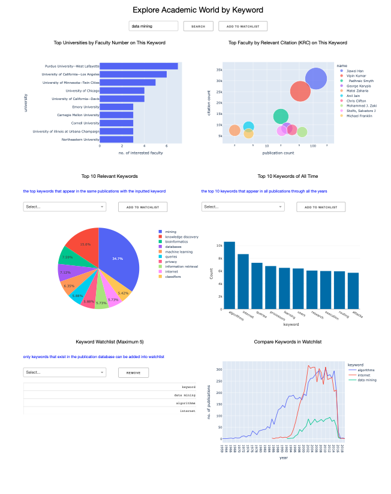

<h1 align="center">
	Academic world
</h1>

<h2> Purpose: What is the application scenario? Who are the target users? What are the objectives? </h2>
<h> The application is designed to be a comprehensive academic exploration and analysis tool. 
It allows users to interactively explore data related to academic keywords, universities, 
faculty members, publications, and citation trends. This application leverages data from 
three databases: MySQL, Neo4j, and MongoDB, enabling users to gain valuable insights into 
the academic landscape, identify top universities, and discover influential faculty members 
and trending research topics.The target users of this application are individuals interested 
in the academic world, including students, researchers, and academics. </h>
 
<h> Objectives: </h>
<li> Users can input keywords to explore related data, including top universities with the 
	highest faculty count for a given keyword and the top professors with the highest Keyword 
	Relevant Citations (KRC) associated with the keyword. </li>
 <li> Users can create a watchlist of favorite keywords, add keywords to the watchlist, and 
	view the trends of their favorite keywords over the years. </li>
 <li> The application provides a bar chart showing the top 10 most popular keywords based on 
	publication counts. </li>
 <li> The application visualizes data using interactive graphs, making it easy for users to 
	understand and explore trends, faculty counts, citation counts, and other relevant information 
	related to academic keywords and universities. </li>

<h2> Demo: Give the link to your video demo. Read the video demo section below to understand what contents are expected in your demo. </h2>
<h> Video link: https://mediaspace.illinois.edu/media/t/1_tlnyy0p9 </h>

<h2> Installation: How to install the application? You don’t need to include instructions on how to install and initially populate the databases if you only use the given dataset. </h2>
<li> install python  </li>
<li> pip install dash plotly pymongo mysql-connector-python py2neo pandas neo4j </li>
<li> input your own database login credentials on the top of app.py file under the "Database access" comment </li>
<li> set up the database and use the dataset 'Academic World'(or the name of your corresponding database)  </li>
<li> Execute python app.py   </li>
<li> open web browser at http://127.0.0.1:8050/ </li>

<h2> Usage: How to use it?  </h2>
<li> Enter a keyword related to an academic topic of interest and click the "Search" button. </li>
<li> Look into the top universities, faculty members and relevant keywords populated in different </li>
<li> Use the "Add to Watchlist" button to add a keyword to your watchlist.
		   Up to five keywords can be added to the watchlist.
		   The "Remove" button allows you to remove a keyword from the watchlist. </li>
<li> The application will show a line graph, "Compare Keywords in Watchlist," representing the
		   trend of each keyword's publications over the years. </li>
<li> A bar chart, "Top 10 Keywords," displays the ten most popular keywords based on publication counts. </li>
<li> compare the trends of multiple keywords from your watchlist. </li>
<li> Select additional keywords from the top 10 keywords or top 10 relevant keywords from the dropdown, list and add them into watchlist by clicking the "Add to Watchlist" button </li>

<h2> Design: What is the design of the application? Overall architecture and components.  </h2>
<h> It follows a client-server architecture. The server is handling user requests and executing 
	database queries. The client interacts with the server through a web browser to visualize 
	and explore the data. </h>
 
<h> Front-End: </h>
<li> Using Dash, a web application framework based on Flask and React.js. </li>
<li> The user interface (UI) allows users to input keywords, add keywords to the watchlist, 
			   explore academic data, and view visualizations. </li>
<h> Back-End: </h>
<li> The back-end communicates with the front-end through callback functions to update visualizations 
			dynamically based on user interactions.	 </li>
<h> Databases: </h>
<li> The application interfaces with MySQL, Neo4j, and MongoDB </li>

<h2> Implementation: How did you implement it? What frameworks and libraries or any tools have you used to realize the dashboard and functionalities?  </h2>
<li> Dash: the framework used for building the web application.  </li>
<li> Plotly Express: This library is used for creating interactive visualizations. </li>
<li> MySQL Connector Python: A library used to connect to the MySQL database and execute queries. </li>
<li> Py2neo: This library is used to connect to the Neo4j graph database and execute queries </li>
<li> pymongo: A library for interacting with MongoDB. </li>
<li> pandas: A data manipulation library used to process and analyze data. </li>
<li>  HTML and CSS: The application's layout is defined using HTML and CSS. </li>

<h2> Database Techniques: What database techniques have you implemented? How?  </h2>
<li> prepared statement, the prepared statement named get_fav_keyword_name is created 
	   during the initialization of the mysql_utils class. This statement simply selects the name 
	   column from the fav_keyword table. 	 </li>
<li> view, use a view called "publication_keyword_name". The view is created using the SQL query defined in the createView variable. </li>
<li> Foreign key constraint, use a Foreign Key constraint in the createTableQuery of the mysql_utils class.  </li>

<h2> Contributions: How each member has contributed, in terms of 1) tasks done and 2) time spent?  </h2>
<h> Xiao: </h>
<li> Implemented the connection for Neo4j database. </li>
<li> Implemented the connection for MySQL database. </li>
<li> Contributed to the design and layout of the HTML and CSS for the application. </li>
<li> time spend: 20hr </li>
<h> Hannah: </h>
<li> Implemented the connection for MongoDB database. </li>
<li> Contributed to the design and layout of the HTML and CSS for the application. </li>
<li> time spend: 20hr </li>
<h> Together: </h>
<li> Collaborated on the development of app.py, integrating data from Neo4j, MySQL, and MongoDB databases, and implementing frontend and backend functionality. </li>
<li> Collaborated on the development of app.py, handling data retrieval from databases, and implementing backend functionality.  </li>
<li> Worked on data visualization using Plotly Express and Dash. </li>
<li> Ensured smooth communication and coordination between different components of the application. </li>
<li> Tested the application and resolved any bugs or issues. </li>
<li> Reviewed and improved the codebase for better performance and maintainability. </li>
<li> Prepared the README.md file and documentation for the project. </li>

  

